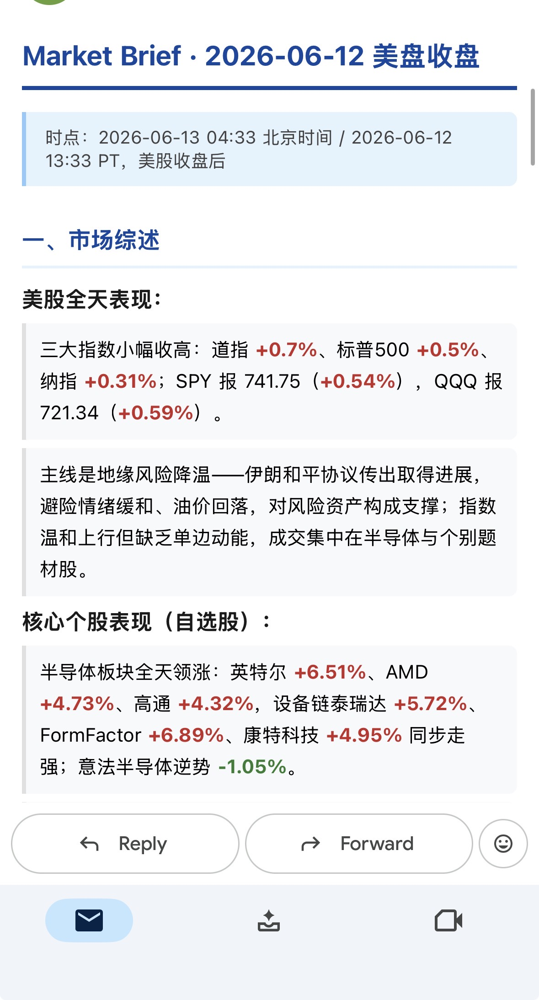

# 哈利每日 Market Brief

**English** | [简体中文](README.zh-CN.md)

> An autonomous, multi-session market-intelligence agent that writes and emails a polished daily market brief — built entirely inside [Claude Code](https://claude.com/claude-code) through "vibe coding."

[]() []()

<p align="center">
  
  <br>
  <em>A brief rendered as a mobile-first email — red = up, green = down (China convention).</em>
</p>

> ⚠️ **This repo is a design case study, not a clone-and-run app.** The pipeline depends on a local Futu OpenD gateway, a brokerage account with quote permissions, Gmail SMTP, and Claude Code scheduled tasks. The value here is the **architecture, prompt engineering, and the evolution story** — not a turnkey binary. See [`docs/`](docs/).

## What it is

A personal tool that emails my team a clean, mobile-first **market brief four times a day**, timed to the Asia and US trading sessions. It runs as an agent inside Claude Code:

1. A Python pipeline (`fetch_data.py`) pulls live quotes, news, analyst research, community sentiment, and a **whole-market "what's hot today" scan** — then dedupes, filters, and emits one structured JSON.
2. The AI reads that JSON and writes the brief as Markdown — **never fabricating numbers**, only describing what's in the data.
3. `send_email.py` renders it to a responsive HTML email and BCC-sends it to the team.
4. Four [scheduled tasks](routines/) fire this flow automatically around market opens/closes.

## The interesting part: market-wide hotspot discovery

Most "watchlist" tools only tell you about stocks you already track. The 🔥 **Today's Hotspots** module finds the sectors moving *across the entire US market* — even ones I've never added:

```
yfinance screeners (day_gainers / losers / most_actives)   →  discover movers (free, no brokerage entitlement)
        ↓ feed tickers to Futu
Futu get_owner_plate  →  map movers to Chinese sector names, count frequency  →  today's hot sectors
        ↓
overlap-dedupe + noise filtering  →  e.g. "🚀 Space / Aerospace (7 stocks +15~22%)"
```

## How it works (inputs → outputs)

| Input | Processing | Output |
|---|---|---|
| Watchlist (Futu), data sources, config | Multi-stage news pipeline (recall → dedupe → recency → similarity → weighting), hotspot scan, analyst-research channel, community sentiment | One `market_data.json` → AI-written Markdown → **responsive HTML email**, 4×/day |

See [`docs/architecture.md`](docs/architecture.md) for the full data flow and JSON schema.

## Tech & data sources

- **Quotes:** Futu OpenAPI (HK/US), yfinance (indices, commodities, FX, rates)
- **Hotspots:** yfinance predefined screeners + Futu `get_owner_plate`
- **News / research / community:** Futu News API (`news_type` 1/3), restricted WebSearch (Bloomberg/CNBC)
- **Delivery:** Gmail SMTP, mobile-first HTML
- **Orchestration:** Claude Code scheduled tasks (cron, local execution)

## The build story

This started as a one-off script and evolved to **V9** over many iterations — each driven by a real failure or limitation. The most instructive moments are written up in [`docs/design-notes.md`](docs/design-notes.md): discovering a Futu API wasn't entitled and pivoting the whole hotspot design; a silent OTC-batch bug that made the AI hallucinate prices; a timezone migration. The full version history is in [`CHANGELOG.md`](CHANGELOG.md).

## Project structure

```
.
├── README.md / README.zh-CN.md   # this page (EN / 中文)
├── CLAUDE.md                      # internal project spec the agent follows (中文)
├── CHANGELOG.md                   # V4 → V9 evolution
├── docs/
│   ├── architecture.md            # data flow, pipeline stages, JSON schema (I/O)
│   └── design-notes.md            # key decisions & war stories
├── skill/SKILL.md                 # the brief generator packaged as a reusable skill
├── routines/                      # the 4 scheduled-task prompts (agent design samples)
├── scripts/
│   ├── fetch_data.py              # data pipeline → structured JSON
│   └── send_email.py              # Markdown → responsive HTML → Gmail SMTP
└── config/                        # *.example templates only (real creds gitignored)
```

## Disclaimer

This project and any output it generates are for informational purposes only and **do not constitute investment advice**.
