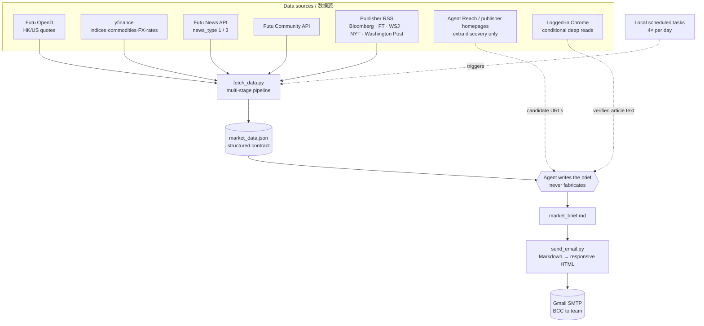

# Architecture / 架构

How data flows from raw sources to a finished email, and the contract (JSON schema) between the pipeline and the writer.

数据如何从原始数据源走到一封成品邮件，以及 pipeline 与"撰写者"之间的契约（JSON schema）。

---

## Data flow / 数据流



## Pipeline stages / Pipeline 各阶段 (`fetch_data.py`)

1. **Quotes / 行情** — `fetch_futu_quotes()` pulls the watchlist (HK/US). Snapshots are *batch-atomic*: one unsupported ticker fails the whole batch, so failures **degrade to per-ticker** and record skips. yfinance fills indices/commodities/FX/rates.
2. **News pipeline / 新闻** — `fetch_news()`: multi-query recall → history dedupe (7-day cache) → cross-section dedupe → recency window (breaking 48h / trend 7d) → title-similarity dedupe → stock-name trap filter → source weighting → time×weight ranking.
3. **Research / 研报** — `fetch_research()`: Futu `news_type=3` (analyst ratings), US+HK only (A-shares dropped), recent, deduped. The query universe is prioritized: watchlist, Mag7, related industries, then current US hotspot movers as fallback.
4. **Hotspots / 热点** — `fetch_hotspots()`: yfinance screeners discover movers → Futu `get_owner_plate` maps to sectors → frequency rank → overlap-dedupe + noise filter.
5. **Community / 社区** — `fetch_community()`: recent (72h), broader watchlist + US tech / semiconductor keyword pool; each post is a real retail voice (title only). Short low-signal titles are filtered before writing.
6. **Publisher RSS / 外媒摘要** — `fetch_external_rss()`: public title + bounded excerpt → seven-day freshness filter → canonical URL history dedupe. Stale feeds return no candidates.
7. **Emit / 输出** — one JSON to stdout; `used_news_ids` feeds the 7-day dedupe cache on send.

## V10.2 two-tier publisher stage / V10.2 两层外媒阶段

`fetch_data.py` collects public Bloomberg / FT / WSJ / NYT / Washington Post RSS titles and excerpts without browser credentials. During writing, the agent upgrades only selected high-value stories to original full-text reads through logged-in Chrome; the Python process never accesses the browser session.

`fetch_data.py` 在不接触浏览器凭证的情况下获取 Bloomberg / FT / WSJ / NYT / Washington Post 公开 RSS 标题与摘要。写作阶段只有高价值文章才升级为已登录 Chrome 原文深读；Python 进程始终不接触浏览器登录态。

Rules / 规则：

1. International, macro, and AI each target at least three distinct news items, with at least one external item and at least one Futu item. Stock/industry still keeps at least one Futu item.
2. Normal target is 7-10 external information points across at least two publishers; usually only 1-3 require Chrome full-text reads.
3. Breaking international/macro stories use a 48h window; AI and stock/industry trends may use 7 days.
4. The same event appears once across publishers and sections. Multi-source source lines are preferred when NYT, Washington Post, WSJ, FT, Bloomberg, and/or Futu cover the same event.
5. `sent_external_news_history.json` stores canonical URLs (query strings/fragments removed) for seven-day cross-routine dedupe.
6. Chrome failure is non-blocking: use the RSS excerpt when sufficient, otherwise fall back to another publisher or Futu.
7. Cookies and browser storage stay local and are never exported to Agent Reach, Exa, or Jina.

## Writer guardrails / 正文输出防线

The final Markdown is reader-facing, not an execution log. The scheduled prompts require a lightweight pre-send scan of `/tmp/market_brief.md`; it fails the run if process-only terms such as raw JSON field names, browser verification failures, unreadable-source logs, or sample-count explanations leak into the brief. The same scan now also checks that international, macro, and AI sections each contain at least three news items.

最终 Markdown 是给读者看的报告，不是执行日志。四个 schedule 在发送前都会对 `/tmp/market_brief.md` 做轻量扫描；如果字段名、浏览器验证失败、来源不可读、样本数量解释等过程性话语进入正文，流程必须先重写再发送。自检也会检查国际、宏观和 AI 三个板块是否各至少包含 3 条新闻信息。

Research and community sections remain data-driven rather than hard-thresholded: use actual available items, write only reader-visible wording when coverage is sparse, and never pad with generic sentiment.

研报和社区板块不设置未经确认的硬门槛：按实际可用内容写；覆盖不足时只用读者可见话术或省略空内容，不能用泛泛情绪判断凑数。

## Output contract / 输出契约 (`market_data.json`)

The pipeline's only output is this JSON. The writer reads it and **must not invent values** — if a field is missing, the brief describes direction, not a fabricated number.

```jsonc
{
  "timestamp_pt": "2026-06-12 13:33 PT",      // explicit zoneinfo, not system tz
  "timestamp_bj": "2026-06-13 04:33 北京时间",
  "date": "2026-06-12",
  "_pipeline_stats": {
    "news_returned": 35,
    "research_queries_count": 24,
    "research_returned": 5,
    "community_keywords_count": 20,
    "community_posts_returned": 8,
    ...
  },
  "used_news_ids": ["post:...", ...],          // written to 7-day dedupe cache on send

  "futu_quotes":    { "US.NVDA": {"name","last","prev","chg"}, "_failed_codes":[...] },
  "yfinance_quotes":{ "上证综指": {"last","prev","chg"}, ... },

  "hotspots": {                                 // US only; two US routines
    "hot_sectors": [ {"name","aka":[],"count","leaders":[{"sym","name","chg"}]} ],
    "top_gainers": [ {"sym","name","chg","vol","price"} ],
    "top_losers":  [ ... ],
    "most_actives":[ ... ],
    "_errors": []
  },

  "news":     { "国际局势":[{"title","date","url","news_id"}], "宏观大宗":[...], ... },
  "research": [ {"title","date","url","news_id"} ],
  "community":{ "美光科技":[{"title","date"}], ... },  // titles = real retail posts
  "external_rss": {                              // public summaries, not full text
    "Bloomberg": [{"title","excerpt","url","date","content_level"}],
    "WSJ": [...], "FT": [...], "NYT": [...], "Washington Post": [...], "_errors": []
  }
}
```

Public RSS candidates are included in `external_rss`; subscription full text is never stored in the JSON. The agent records every external URL actually used, whether RSS-only or Chrome-deep-read, in `/tmp/used_external_urls.json`; after a successful send, `send_email.py --external-urls-file` updates the rolling external history cache.

## Brief structure / Brief 结构

The writer turns that JSON into a fixed Markdown skeleton (rendered to mobile-first HTML, red=up/green=down per China convention):

```
一、Market Overview        市场综述
二、🔥 Today's Hotspots     今日热点   (US routines only)
三、Key News (7 sections)   重点新闻  🌍国际 🏛️宏观 🤖AI 📊个股/行业 📑研报 📱A股/港股 💬社区
四、Macro Environment       宏观环境
```

The macro section includes a clearly attributed **Media View** followed by a **Core Observation** that cross-checks those views against rates, FX, commodities, and equity data.

The four [`routines/`](../routines/) prompts share the same V10.2 media protocol, writer guardrails, and research/community expansion rules; they differ only in session focus (Asia pre-open / Asia midday / US pre-open / US close).
