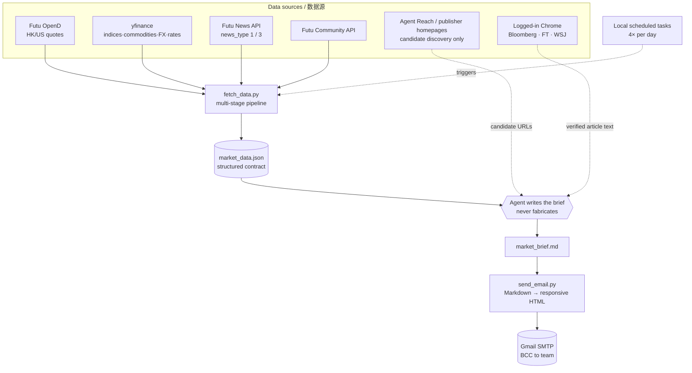

# Architecture / 架构

How data flows from raw sources to a finished email, and the contract (JSON schema) between the pipeline and the writer.

数据如何从原始数据源走到一封成品邮件，以及 pipeline 与"撰写者"之间的契约（JSON schema）。

---

## Data flow / 数据流



## Pipeline stages / Pipeline 各阶段 (`fetch_data.py`)

1. **Quotes / 行情** — `fetch_futu_quotes()` pulls the watchlist (HK/US). Snapshots are *batch-atomic*: one unsupported ticker fails the whole batch, so failures **degrade to per-ticker** and record skips. yfinance fills indices/commodities/FX/rates.
2. **News pipeline / 新闻** — `fetch_news()`: multi-query recall → history dedupe (7-day cache) → cross-section dedupe → recency window (breaking 48h / trend 7d) → title-similarity dedupe → stock-name trap filter → source weighting → time×weight ranking.
3. **Research / 研报** — `fetch_research()`: Futu `news_type=3` (analyst ratings), US+HK only (A-shares dropped), recent, deduped.
4. **Hotspots / 热点** — `fetch_hotspots()`: yfinance screeners discover movers → Futu `get_owner_plate` maps to sectors → frequency rank → overlap-dedupe + noise filter.
5. **Community / 社区** — `fetch_community()`: recent (72h), US-focused; each post is a real retail voice (title only).
6. **Emit / 输出** — one JSON to stdout; `used_news_ids` feeds the 7-day dedupe cache on send.

## V10 subscription-media stage / V10 订阅外媒阶段

Subscription journalism is deliberately kept out of `fetch_data.py`: the Python process has no access to the user's browser login. During writing, the local agent discovers candidates and reads the original Bloomberg / FT / WSJ article through the logged-in Chrome session.

订阅外媒刻意不放进 `fetch_data.py`：Python 进程不接触浏览器登录态。写作阶段由本地 agent 发现候选，并通过已登录 Chrome 读取 Bloomberg / FT / WSJ 原文。

Rules / 规则：

1. International gets 1 external item; macro, AI, and stock/industry get 1-2 each. Every section also keeps at least one Futu item.
2. Normal target is 5-7 external stories across at least two publishers. Relevance beats publisher quotas.
3. Breaking international/macro stories use a 48h window; AI and stock/industry trends may use 7 days.
4. The same event appears once across publishers and sections. Futu and an external source may share one source line.
5. `sent_external_news_history.json` stores canonical URLs (query strings/fragments removed) for seven-day cross-routine dedupe.
6. Chrome/publisher failure is non-blocking. The section falls back to Futu; Bloomberg robot checks are never bypassed.
7. Cookies and browser storage stay local and are never exported to Agent Reach, Exa, or Jina.

## Output contract / 输出契约 (`market_data.json`)

The pipeline's only output is this JSON. The writer reads it and **must not invent values** — if a field is missing, the brief describes direction, not a fabricated number.

```jsonc
{
  "timestamp_pt": "2026-06-12 13:33 PT",      // explicit zoneinfo, not system tz
  "timestamp_bj": "2026-06-13 04:33 北京时间",
  "date": "2026-06-12",
  "_pipeline_stats": { "news_returned": 35, "research_returned": 5, ... },
  "used_news_ids": ["post:...", ...],          // written to 7-day dedupe cache on send

  "futu_quotes":    { "US.NVDA": {"name","last","prev","chg"}, "_failed_codes":[...] },
  "yfinance_quotes":{ "上证综指": {"last","prev","chg"}, ... },

  "hotspots": {                                 // US only; two US routines
    "hot_sectors": [ {"name","aka":[],"count","leaders":[{"sym","name","chg"}]} ],
    "top_gainers": [ {"sym","name","chg","vol","price"} ],
    "top_losers":  [ ... ],
    "most_actives":[ ... ],
    "_errors": []
  },

  "news":     { "国际局势":[{"title","date","url","news_id"}], "宏观大宗":[...], ... },
  "research": [ {"title","date","url","news_id"} ],
  "community":{ "美光科技":[{"title","date"}], ... }   // titles = real retail posts
}
```

External articles are not injected into this JSON. The agent records the exact URLs it used in `/tmp/used_external_urls.json`; after a successful send, `send_email.py --external-urls-file` updates the rolling external history cache.

## Brief structure / Brief 结构

The writer turns that JSON into a fixed Markdown skeleton (rendered to mobile-first HTML, red=up/green=down per China convention):

```
一、Market Overview        市场综述
二、🔥 Today's Hotspots     今日热点   (US routines only)
三、Key News (7 sections)   重点新闻  🌍国际 🏛️宏观 🤖AI 📊个股/行业 📑研报 📱A股/港股 💬社区
四、Macro Environment       宏观环境
```

The macro section includes a clearly attributed **Media View** followed by a **Core Observation** that cross-checks those views against rates, FX, commodities, and equity data.

The four [`routines/`](../routines/) prompts share the same V10 media protocol and differ only in session focus (Asia pre-open / Asia midday / US pre-open / US close).
